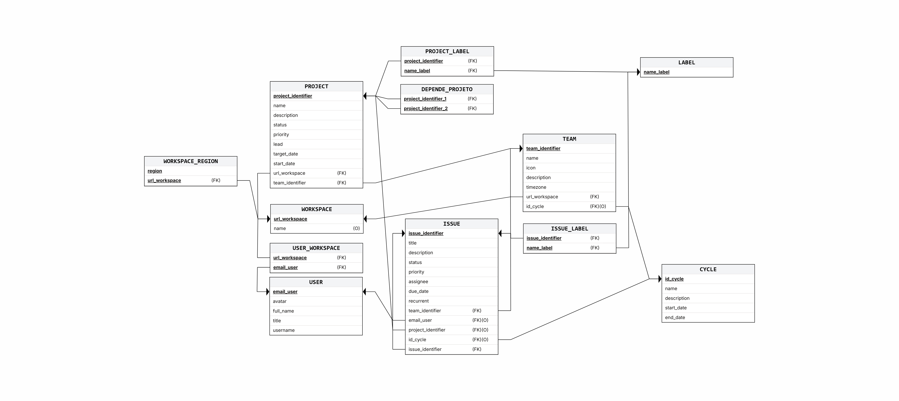

# Atividade 3 - Modelagem de Dados e Comandos SQL

## Aluno
- **Rubens Ferreira**

---

## 1. Diagrama Relacional

---

## 2. Dicionário de Dados

### Tabela: `USER`
* **Descrição:** Armazena os dados dos usuários cadastrados no sistema.

| Nome do Campo | Descrição | Tipo de Dado | Tamanho | PK | FK | Unique | Null | Default |
| :--- | :--- | :--- | :--- | :---: | :---: | :---: | :---: | :--- |
| **email_user** | E-mail de cadastro do usuário | VARCHAR | 100 | Sim | Não | Sim | Não | |
| **avatar** | URL da foto do usuário | VARCHAR | 255 | Não | Não | Não | Sim | |
| **full_name** | Nome completo do usuário | VARCHAR | 100 | Não | Não | Não | Sim | |
| **title** | Função do usuário | VARCHAR | 50 | Não | Não | Não | Sim | |
| **username** | Nome de usuário único | VARCHAR | 50 | Não | Não | Sim | Não | |

---

### Tabela: `WORKSPACE`
* **Descrição:** Área de trabalho de um projeto 

| Nome do Campo | Descrição | Tipo de Dado | Tamanho | PK | FK | Unique | Null | Default |
| :--- | :--- | :--- | :--- | :---: | :---: | :---: | :---: | :--- |
| **url_workspace** | Url de acesso do workspace| VARCHAR | 150 | Não | Não | Sim | Não | |
| **name** | Nome do workspace | VARCHAR | 150 | Sim | Não | Não | Não | |

---

### Tabela: `WORKSPACE_REGION`
* **Descrição:** Define as regiões/timezones geográficas associadas ao workspace.

| Nome do Campo | Descrição | Tipo de Dado | Tamanho | PK | FK | Unique | Null | Default |
| :--- | :--- | :--- | :--- | :---: | :---: | :---: | :---: | :--- |
| **region** | Nome da região geográfica | VARCHAR | 100 | Sim | Não | Não | Não | |
| **url_workspace** | URL do workspace associado | VARCHAR | 150 | Sim | Sim | Não | Não | |

---

### Tabela: `USER_WORKSPACE`
* **Descrição:** Relação entre User e Workspace

| Nome do Campo | Descrição | Tipo de Dado | Tamanho | PK | FK | Unique | Null | Default |
| :--- | :--- | :--- | :--- | :---: | :---: | :---: | :---: | :--- |
| **email_user** | E-mail do usuário | VARCHAR | 100 | Sim | Sim | Não | Não | |
| **url_workspace** | URL do workspace | VARCHAR | 150 | Sim | Sim | Não | Não | |

---

### Tabela: `CYCLE`
* **Descrição:** Representa os ciclos (sprints ou iterações) de tempo de trabalho.

| Nome do Campo | Descrição | Tipo de Dado | Tamanho | PK | FK | Unique | Null | Default |
| :--- | :--- | :--- | :--- | :---: | :---: | :---: | :---: | :--- |
| **id_cycle** | Identificador único do ciclo | INT | | Sim | Não | Sim | Não | |
| **name** | Nome do ciclo | VARCHAR | 150 | Não | Não | Não | Não | |
| **description** | Descrição do ciclo | VARCHAR | 250 | Não | Não | Não | Não | |
| **start_date** | Data de início do ciclo | DATE | | Não | Não | Não | Não | |
| **end_date** | Data final do ciclo | DATE | | Não | Não | Não | Não | |

---

### Tabela: `TEAM`
* **Descrição:** Time dentro de um workspace.

| Nome do Campo | Descrição | Tipo de Dado | Tamanho | PK | FK | Unique | Null | Default |
| :--- | :--- | :--- | :--- | :---: | :---: | :---: | :---: | :--- |
| **team_identifier**| Sigla identificadora do time | VARCHAR | 07 | Sim | Não | Sim | Não | |
| **name** | Nome do time | VARCHAR | 150 | Não | Não | Não | Não | |
| **icon** | Icone do time| VARCHAR | 255 | Não | Não | Não | Não | |
| **description** | Descrição do time | VARCHAR | 250 | Não | Não | Não | Sim | |
| **timezone** | Timezone de trabalho do time | INT | | Não | Não | Não | Não | |
| **url_workspace** | URL do workspace do time | VARCHAR | 150 | Não | Sim | Não | Não | |
| **id_cycle** | Ciclo ativo associado ao time | INT | | Não | Sim | Não | Sim | |

---

### Tabela: `PROJECT`
* **Descrição:** Projetos que agrupam issues dentro de um workspace.

| Nome do Campo | Descrição | Tipo de Dado | Tamanho | PK | FK | Unique | Null | Default |
| :--- | :--- | :--- | :--- | :---: | :---: | :---: | :---: | :--- |
| **project_identifier**| Identificador único do projeto | INT | | Sim | Não | Sim | Não | |
| **name** | Nome do projeto | VARCHAR | 150 | Não | Não | Não | Não | |
| **description** | Descrição do projeto | VARCHAR | 250 | Não | Não | Não | Sim | |
| **status** | Status atual do projeto | VARCHAR | 50 | Não | Não | Não | Não | |
| **priority** | Prioridade do projeto | INT | | Não | Não | Não | Sim | |
| **lead** | Usuário líder/responsável | VARCHAR | 100 | Não | Sim | Sim | Não | |
| **target_date** | Data estimada de término | DATE | | Não | Não | Não | Sim | |
| **start_date** | Data de início do projeto | DATE | | Não | Não | Não | Sim | |
| **url_workspace** | URL do workspace | VARCHAR | 150 | Não | Sim | Não | Não | |
| **team_identifier**| ID do time dono do projeto | VARCHAR | 07 | Não | Sim | Não | Não | |

---

### Tabela: `DEPENDE_PROJETO`
* **Descrição:** Relação de dependência entre projetos.

| Nome do Campo | Descrição | Tipo de Dado | Tamanho | PK | FK | Unique | Null | Default |
| :--- | :--- | :--- | :--- | :---: | :---: | :---: | :---: | :--- |
| **project_identifier_1**| ID do projeto dependente | INT | | Sim | Sim | Não | Não | |
| **project_identifier_2**| ID do projeto pré-requisito | INT | | Sim | Sim | Não | Não | |

---

### Tabela: `ISSUE`
* **Descrição:** Unidade de tarefa individual (Issue). Suporta sub-issues através de autorreferenciamento.

| Nome do Campo | Descrição | Tipo de Dado | Tamanho | PK | FK | Unique | Null | Default |
| :--- | :--- | :--- | :--- | :---: | :---: | :---: | :---: | :--- |
| **identifier** | Código identificador da issue | VARCHAR | 50 | Sim | Não | Sim | Não | |
| **title** | Título ou resumo da tarefa | VARCHAR | 150 | Não | Não | Não | Não | |
| **description** | Descrição detalhada da issue | TEXT | | Não | Não | Não | Sim | |
| **status** | Status atual da issue | VARCHAR | 50 | Não | Não | Não | Não | |
| **priority** | Nível de prioridade | INT | | Não | Não | Não | Sim | |
| **team_identifier**| ID do time dono da issue | VARCHAR | 07 | Não | Sim | Não | Não | |
| **email_user** | E-mail do usuário responsável | VARCHAR | 100 | Não | Sim | Não | Sim | |
| **project_identifier**| ID do projeto associado | INT | | Não | Sim | Não | Sim | |
| **id_cycle** | ID do ciclo (sprint) associado | INT | | Não | Sim | Não | Sim | |
| **issue_identifier**| ID da issue pai (sub-issue) | VARCHAR | 50 | Não | Sim | Não | Sim | |
| **due_date** | Prazo para entrega da issue | DATE | | Não | Não | Não | Sim | |
| **recurrent** | Indica se a issue é recorrente | BOOLEAN | | Não | Não | Não | Não | FALSE |

---

### Tabela: `LABEL`
* **Descrição:** Etiquetas (Labels) para classificar issues ou projetos.

| Nome do Campo | Descrição | Tipo de Dado | Tamanho | PK | FK | Unique | Null | Default |
| :--- | :--- | :--- | :--- | :---: | :---: | :---: | :---: | :--- |
| **name** | Nome/Texto da etiqueta | VARCHAR | 07 | Sim | Não | Sim | Não | |

---

### Tabela: `ISSUE_LABEL`
* **Descrição:** Tabela associativa entre issues e labels.

| Nome do Campo | Descrição | Tipo de Dado | Tamanho | PK | FK | Unique | Null | Default |
| :--- | :--- | :--- | :--- | :---: | :---: | :---: | :---: | :--- |
| **issue_identifier**| Código identificador da issue | VARCHAR | 50 | Sim | Sim | Não | Não | |
| **name_label** | Nome da etiqueta | VARCHAR | 07 | Sim | Sim | Não | Não | |

---

### Tabela: `PROJECT_LABEL`
* **Descrição:** Tabela associativa entre projetos e labels.

| Nome do Campo | Descrição | Tipo de Dado | Tamanho | PK | FK | Unique | Null | Default |
| :--- | :--- | :--- | :--- | :---: | :---: | :---: | :---: | :--- |
| **project_identifier**| ID do projeto | INT | | Sim | Sim | Não | Não | |
| **name_label** | Nome da etiqueta | VARCHAR | 07 | Sim | Sim | Não | Não | |
